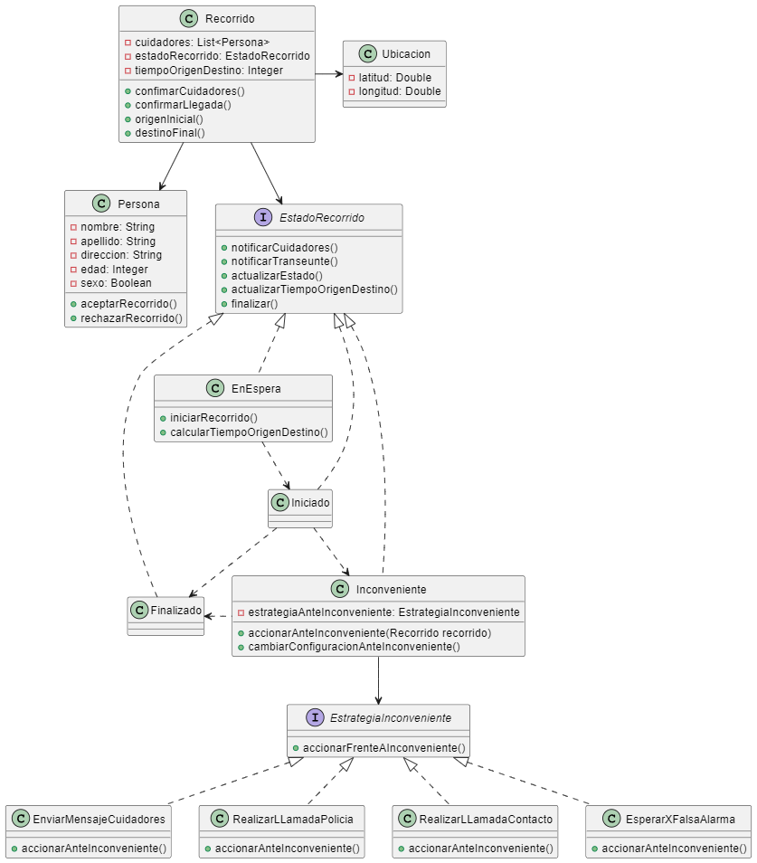

# Cuidándonos-Tarea-de-a-pares

### Integrantes
* Gabriel Sirota
* Mastroianni Sebastian

1. El diagrama de la solución sería este:
    
    
    ### Justificacion
    - Utilizamos el patron Strategy para representar las distintas formas de accionar frente a un inconveniente ya que nos permite representar distintas maneras/estrategias de reaccionar frente al mismo suceso.
    - Decidimos utilizar el patron State ya que nos sirvió para representar las transiciones entre los distintos estados que puede llegar a tener un Recorrido. Y porque era necesario que cada estado conozca al otro.

2. 
    * El diagrama de la nueva solución incluyendo una lista de paradas junto con el tiempo de demora:
    

    * Implementación del cálculo del tiempo de demora

        
        ```Java
        Integer calcularTiempoDemora(Recorrido recorrido ){

            int tiempoPrimerParada = calcularTiempoParada();
            int tiempoParadas = paradas.stream().mapToInt(Recorrido::calcularTiempoParada).sum();
            return tiempoPrimerParada + tiempoParadas;
        }

        Integer calcularTiempoParada(){
            return tiempoOrigenDestino + esperaMin;
        }
        ```

        >ℹ️ El cálculo de tiempoOrigenDestino se haría llamando a "Distance Matrix API" como se menciona en el enunciado